# A fuzzy system for assessing the mood of songs based on their acoustic characteristics

## About project
The aim of the project was to develop a fuzzy system for assessing the mood of musical pieces based on their acoustic characteristics, 
such as **energy**, **valence** (level of emotion - emotional charge) and **danceability**. The developed algorithm is able to determine 
the **mood of a song** (sad, neutral, happy) by analysing these parameters.

The system allows the music to be better matched to the listener's emotions, which can influence the listener's experience and create more 
personalised playlists, as well as support music therapies.

## Dataset
The **dataset** used is from the kaggle platform and includes 114000 songs by different artists.

## Technologies
The project was implemented using **Python** in the **Google Colab** environment.

**Libraries** used in the project:
- numpy - operations on arrays, matrices and vectors,
- pandas - processing of tabular data,
- matplotlib.pyplot - creating graphs,
- seaborn - data visualisation, supporting matplotlib,
- google.colab - environment for running Python code in the cloud, particularly useful for data analysis and machine learning,
- Ipywidgets - A library to create interactive widgets in Jupyter notebooks for user interaction,
- IPython.display - displaying images and sounds,
- mpl_toolkits.mplot3d - A tool in Matplotlib for creating 3D graphs,
- **scikit-fuzzy** - Library for implementing fuzzy systems and fuzzy algorithms in Python.

## Descriptive characteristics of input and output variables
**Input variables:**
- **Energeticity**: represents the intensity of the music (low, medium, high), measured by signal amplitude analysis.
LOW (blue)       MEDIUM (orange)       HIGH (green)

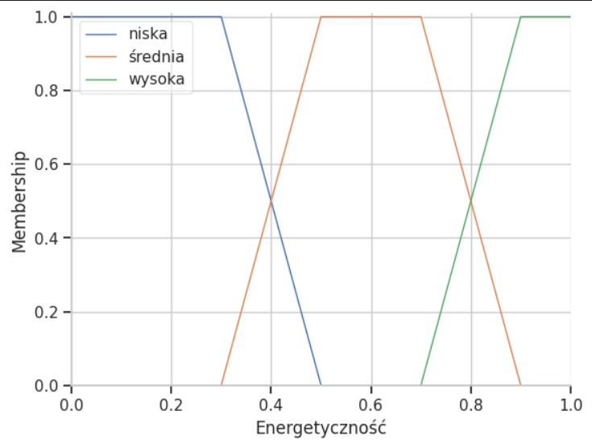

- **Emotional charge**: represents the level of emotion expressed in the music (from depressive to euphoric). Obtained by analysing the tonality, harmony and chord structure of the piece.
NEGATIVE (blue)       UNMARKED (orange)       POSITIVE (green)

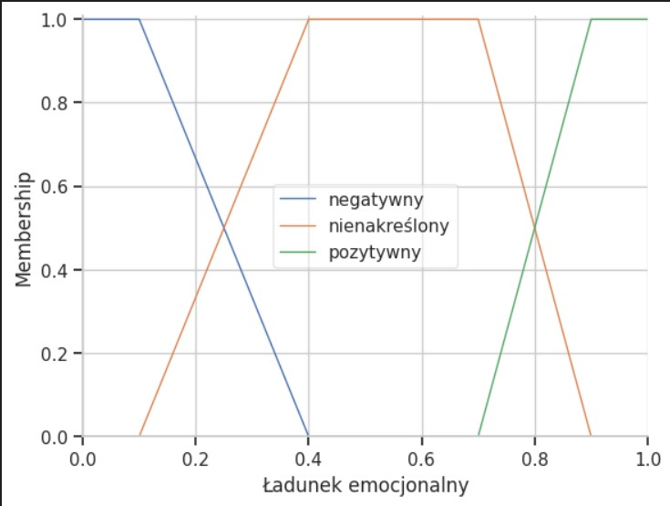

- **Danceability**: determines how danceable the piece is, based on the rhythm and tempo of the piece. This is a variable that can be analysed using rhythm analysis tools.
NON-DANCE (blue)       MEDIUM DANCE (orange)       DANCE (green)

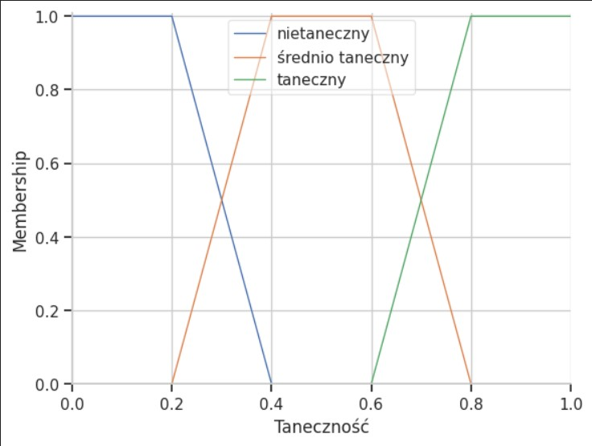

**Output variables:**
- **Mood**: determines what emotion the piece evokes (sad, neutral or happy).
SAD (blue)       NEUTRAL (orange)       HAPPY (green)

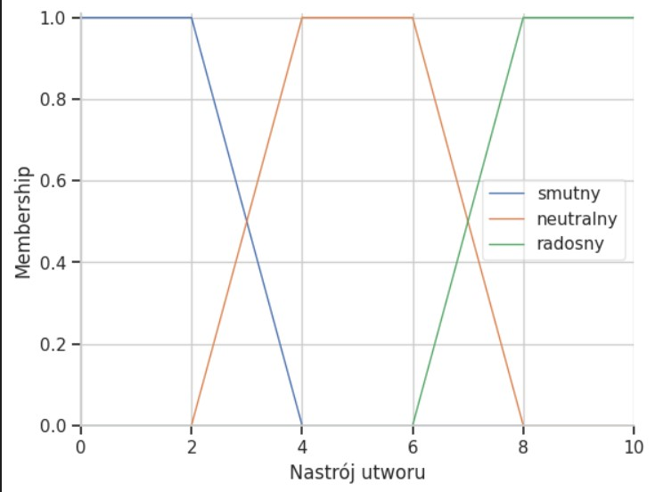

## Implementation

I chose the Mamdani model for generating the rules in the system because of its simplicity and intuitiveness, which are particularly important 
in the context of fuzzy mood ratings of musical pieces. It is perfect for generating rules such as “if the energeticity is low and the valence 
is negative, the mood is sad”, which is a natural approach to expressing the relationship between music features and emotions.

In addition, the Mamdani model allows for easy interpretation of the results, which is important for music recommendation systems where the user 
expects transparency and simplicity in understanding results like identifying a song as “happy” or “sad”.

The rules were developed by me based on intuition and personal perception of music. For example, low energy and negative valence are intuitively 
associated with “sadness”, which can be used in the rules of the system.

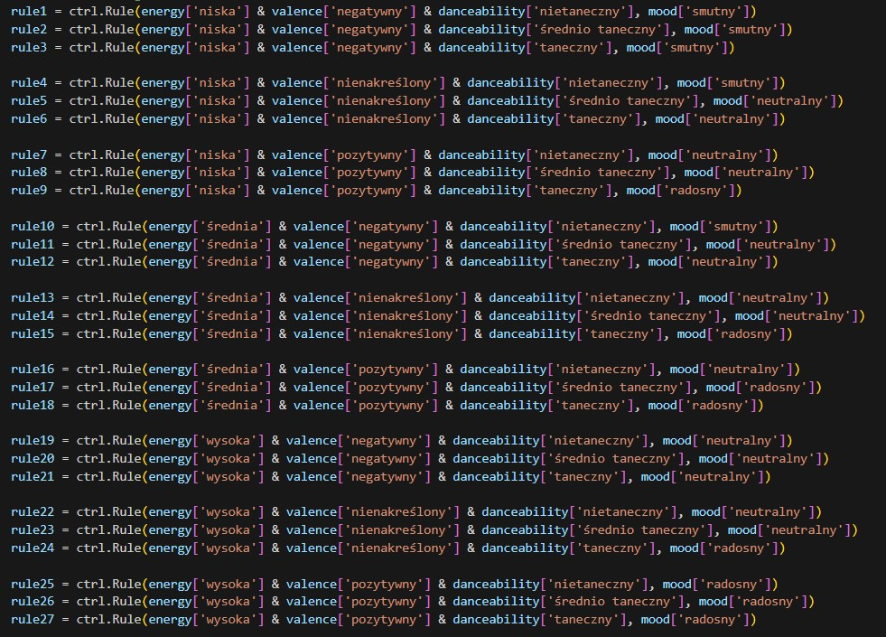

## Images
**Dataset:**

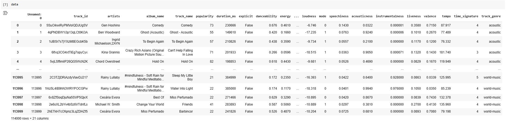

**Appearance of the interface for searching and selecting songs:**

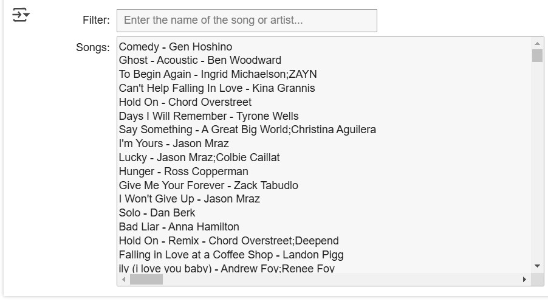

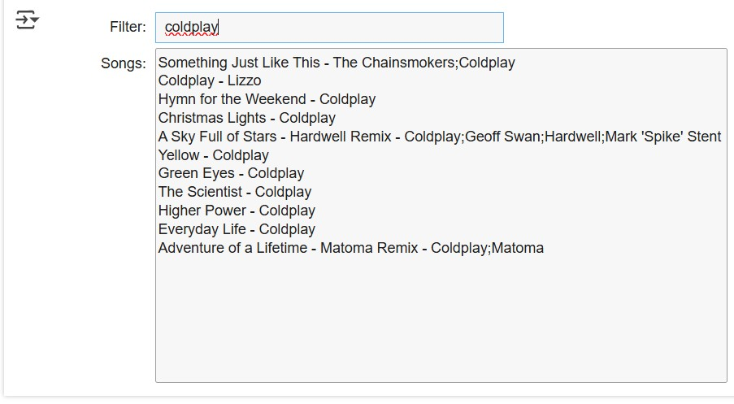

The interface created allows the user to easily search for songs by using a filter to enter the name of the artist or their song.

## Scenarios and results

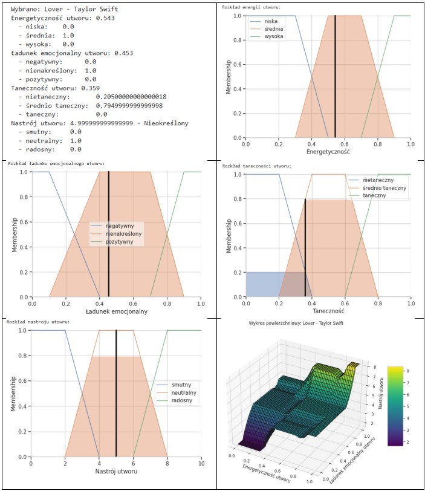

In the case of the song “Lover” (Taylor Swift), the fuzzy inference system indicated an indeterminate mood, with a predominantly neutral mood. 
Despite its medium energy and neutral emotional charge, the song did not reach sufficient strength to clearly classify the mood into “sad” or “happy”. 
This result is as expected, as it is a piece with a calm character that does not evoke extreme emotions.

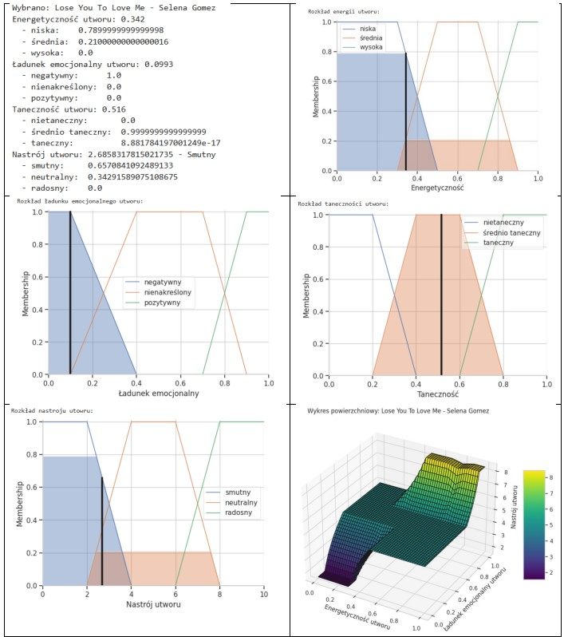

In this case, the system indicated a sad mood of 66 per cent and some presence of a neutral mood. The song “Lose You to Love Me” has a low energy level 
and its emotional charge is strongly negative, resulting in a classification as sad. This is in line with what we would expect given the lyrics and emotional 
charge of this song.

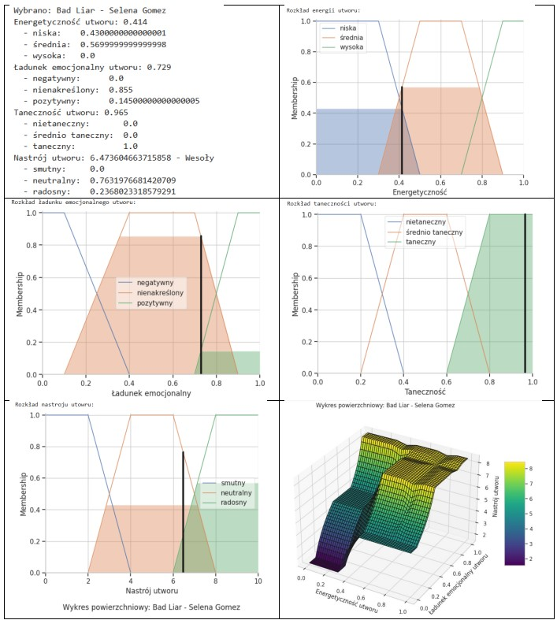

The song “Bad Liar” (Selena Gomez) has a positive emotional charge and a high danceability, which influences the inference score indicating a happy mood. 
The happy score is not dominant (containing 24%), and the system also assigns a significant part of the inferred mood to the neutral category. This is
in line with the characteristics of the song, which, despite its energy and positive emotional charge, may contain a degree of melancholy.
